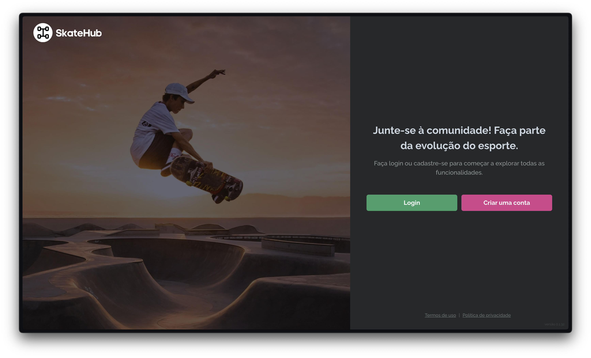

<h1 align="center">
    
</h1>

<p align="center">
  A social platform built for the skateboarding community.
</p>

<p align="center">
  
  
  
  
  
  <a href="https://skatehub.vercel.app">
    
  </a>
</p>

<p align="center">
  <a href="https://skatehub.vercel.app">Live Demo</a>&nbsp;&nbsp;·&nbsp;&nbsp;
  <a href="#-features">Features</a>&nbsp;&nbsp;·&nbsp;&nbsp;
  <a href="#-tech-stack">Tech Stack</a>&nbsp;&nbsp;·&nbsp;&nbsp;
  <a href="#-getting-started">Getting Started</a>&nbsp;&nbsp;·&nbsp;&nbsp;
  <a href="#-changelog">Changelog</a>
</p>

---



---

## About

SkateHub is a full-stack social platform for the skateboarding community, built as a graduate program capstone project. It allows skaters to discover and share spots, follow each other through stories, manage their profiles, and get skating advice from an AI assistant — all in one place.

The frontend is built with **Next.js 16 App Router**, **TypeScript**, and **Chakra UI**, consuming a **Strapi** REST API. The architecture prioritises security, observability, and maintainability with patterns like centralised auth, cookie-based sessions, vendor-swappable observability, and spec-driven development.

---

## ✨ Features

### Authentication
- Sign in and sign up with email and password
- Email confirmation flow
- Forgot password and reset password
- Invisible reCAPTCHA v2 protection on all auth forms
- Authenticated sessions via secure HTTP-only cookies
- Automatic session expiry detection and sign-out

### User Profiles
- Editable profile with name, bio, and skill category
- Avatar upload with cloud storage (Cloudinary via Strapi)
- Instagram profile link
- Public user profile pages

### Stories
- Post and view 24-hour ephemeral stories
- Full-screen swiper with per-user story groups
- Auto-advance to next user when all stories in a group end

### Spots
- Browse, create, edit, and delete skate spots
- Photo gallery upload per spot
- Google Maps embed with address lookup
- Owner-only edit and delete controls
- Public spot detail pages

### AI Assistant
- Streaming chat interface for skateboarding questions
- Token-by-token response rendering (SSE)
- Markdown rendering for structured answers
- Powered by OpenRouter / Google Gemini
- Authentication-gated — sign in to use

### Observability
- Error tracking via Sentry with distributed tracing to the Strapi backend
- Product analytics via PostHog
- Performance monitoring via Vercel Speed Insights and Analytics
- Vendor-swappable observability layer — all providers can be disabled or replaced in one place

### General
- Dark and light mode
- Responsive layout (mobile + desktop)
- Custom 404 page
- Sitemap API route

---

## 🛠 Tech Stack

| Layer | Technology |
|-------|-----------|
| Framework | [Next.js 16](https://nextjs.org) (App Router) |
| Language | [TypeScript 5](https://www.typescriptlang.org) |
| UI Library | [Chakra UI 2](https://chakra-ui.com) |
| Data Fetching | [TanStack Query 5](https://tanstack.com/query) |
| Forms | [React Hook Form](https://react-hook-form.com) + [Zod](https://zod.dev) |
| Auth | Custom cookie auth via [nookies](https://github.com/maticzav/nookies) + reCAPTCHA v2 |
| HTTP Client | [Axios](https://axios-http.com) (centralised `apiClient`) |
| Backend / CMS | [Strapi](https://strapi.io) (REST API) |
| Maps | [Mapbox GL](https://docs.mapbox.com/mapbox-gl-js/) |
| AI | [OpenRouter](https://openrouter.ai) / [Google Gemini](https://ai.google.dev) |
| Observability | [Sentry](https://sentry.io), [PostHog](https://posthog.com), [Vercel Analytics](https://vercel.com/analytics) |
| Deployment | [Vercel](https://vercel.com) |
| Package Manager | [pnpm](https://pnpm.io) |

---

## 🚀 Getting Started

### Prerequisites

- [Node.js](https://nodejs.org) ≥ 18
- [pnpm](https://pnpm.io) (`npm install -g pnpm`)
- The [SkateHub backend](https://github.com/jpcmf/Backend-GraduateProgram-FullStack-2023) running locally or accessible via URL

### Step 1 — Clone the repository

```bash
git clone https://github.com/jpcmf/Frontend-GraduateProgram-FullStack-2024.git
cd Frontend-GraduateProgram-FullStack-2024
```

### Step 2 — Switch to the develop branch

```bash
git checkout develop
```

### Step 3 — Configure environment variables

```bash
cp .env.example .env.local
```

Then fill in the values in `.env.local` — see the table below for reference.

### Step 4 — Install dependencies

```bash
pnpm install
```

### Step 5 — Run the development server

```bash
pnpm dev
```

The app will be available at [http://localhost:3000](http://localhost:3000).

---

## 🔑 Environment Variables

| Variable | Required | Description |
|----------|----------|-------------|
| `NEXT_PUBLIC_STRAPI_URL` | Yes | Base URL of the Strapi backend (e.g. `http://localhost:1337`) |
| `NEXT_PUBLIC_RECAPTCHA_SITE_KEY` | Yes | reCAPTCHA v2 site key (public) — from [Google reCAPTCHA](https://www.google.com/recaptcha/admin) |
| `RECAPTCHA_SECRET_KEY` | Yes | reCAPTCHA v2 secret key (server-only) |
| `NODEMAILER_TRANSPORTER_SERVICE` | Yes | Email service (e.g. `gmail`) |
| `NODEMAILER_TRANSPORTER_USER` | Yes | Email account username |
| `NODEMAILER_TRANSPORTER_PASS` | Yes | Email account password or app password |
| `NODEMAILER_OPTIONS_FROM` | Yes | Sender address |
| `NODEMAILER_OPTIONS_TO` | Yes | Recipient address for confirmations |
| `NEXT_PUBLIC_ACCESS_TOKEN_MAP_BOX` | Yes | Mapbox public access token — from [Mapbox](https://account.mapbox.com) |
| `NEXT_PUBLIC_URL_MAP_BOX` | Yes | Mapbox tiles base URL |
| `NEXT_PUBLIC_OBSERVABILITY_ENABLED` | No | Set to `true` to enable Sentry + PostHog (default: `false`) |
| `NEXT_PUBLIC_SENTRY_DSN` | No | Sentry DSN — from Sentry project settings |
| `SENTRY_ORG` | No | Sentry organisation slug |
| `SENTRY_PROJECT` | No | Sentry project slug |
| `SENTRY_AUTH_TOKEN` | No | Sentry auth token for source-map uploads (CI only) |
| `NEXT_PUBLIC_POSTHOG_KEY` | No | PostHog project API key |
| `NEXT_PUBLIC_POSTHOG_HOST` | No | PostHog host (default: `https://app.posthog.com`) |
| `GOOGLE_GENERATIVE_AI_KEY` | No | Google Gemini API key — from [AI Studio](https://aistudio.google.com/app/apikeys) |
| `OPENROUTER_API_KEY` | No | OpenRouter API key — from [openrouter.ai/keys](https://openrouter.ai/keys) |

---

## 📋 Changelog

### Recent changes

- 2026-04-30 - Fix login modal redirecting to "/" when opened from any route [#176](https://github.com/jpcmf/Frontend-GraduateProgram-FullStack-2024/pull/176) _(v1.2.0)_
- 2026-04-29 - Add AI Assistant with streaming SSE, auth gate, and Markdown rendering [#172](https://github.com/jpcmf/Frontend-GraduateProgram-FullStack-2024/pull/172) _(v1.2.0)_
- 2026-04-27 - Add `tracePropagationTargets` to Sentry config for distributed tracing [#170](https://github.com/jpcmf/Frontend-GraduateProgram-FullStack-2024/pull/170) _(v1.1.1)_
- 2026-04-27 - Add vendor-swappable observability layer (Sentry, PostHog, Vercel) [#166](https://github.com/jpcmf/Frontend-GraduateProgram-FullStack-2024/pull/166) _(v1.1.0)_
- 2026-04-12 - App Router migration [#160](https://github.com/jpcmf/Frontend-GraduateProgram-FullStack-2024/pull/160) _(v1.0.0)_

→ [Full changelog](./CHANGELOG.md)

---

## License

All rights reserved. © 2024–2026 [João Paulo](https://jpcmf.dev).

Unauthorized use, reproduction, or distribution of this software or any portion of it is strictly prohibited without explicit written permission from the author.

---

<p align="center">Made with <span style="color: #6664F1;">♥</span> in Brazil</p>
